# CRM Database ERD

Generated from site metadata and database columns for CRM/FCRM tables on `crm.localhost`.

- Includes all SQL columns for tables matching `tabCRM %` and `tabFCRM %`.
- Includes inferred relationships from DocField `Link`, `Table`, and `Table MultiSelect` fields.

```mermaid
erDiagram
  CRM_AI_Conversation {
    varchar name PK
    datetime creation
    datetime modified
    varchar modified_by
    varchar owner
    tinyint docstatus
    int idx
    varchar user
    varchar conversation_type
    varchar reference_doctype
    varchar reference_name
    longtext user_message
    longtext ai_response
    text _user_tags
    text _comments
    text _assign
    text _liked_by
  }
  CRM_AI_Suggestion {
    varchar name PK
    datetime creation
    datetime modified
    varchar modified_by
    varchar owner
    tinyint docstatus
    int idx
    varchar suggestion_type
    varchar status
    varchar reference_doctype
    varchar reference_name
    longtext suggestion
    longtext metadata
    text rejection_reason
    text _user_tags
    text _comments
    text _assign
    text _liked_by
  }
  CRM_Call_Log {
    varchar name PK
    datetime creation
    datetime modified
    varchar modified_by
    varchar owner
    tinyint docstatus
    int idx
    varchar telephony_medium
    varchar id
    varchar from
    varchar status
    decimal duration
    varchar medium
    datetime start_time
    varchar reference_doctype
    varchar reference_docname
    varchar to
    varchar type
    varchar receiver
    varchar caller
    varchar recording_url
    datetime end_time
    varchar note
    text _user_tags
    text _comments
    text _assign
    text _liked_by
  }
  CRM_Communication_Status {
    varchar name PK
    datetime creation
    datetime modified
    varchar modified_by
    varchar owner
    tinyint docstatus
    int idx
    varchar status
    text _user_tags
    text _comments
    text _assign
    text _liked_by
  }
  CRM_Contacts {
    varchar name PK
    datetime creation
    datetime modified
    varchar modified_by
    varchar owner
    tinyint docstatus
    int idx
    varchar contact
    varchar full_name
    varchar email
    varchar gender
    varchar mobile_no
    varchar phone
    tinyint is_primary
    varchar parent
    varchar parentfield
    varchar parenttype
  }
  CRM_Dashboard {
    varchar name PK
    datetime creation
    datetime modified
    varchar modified_by
    varchar owner
    tinyint docstatus
    int idx
    varchar title
    tinyint private
    varchar user
    longtext layout
    text _user_tags
    text _comments
    text _assign
    text _liked_by
  }
  CRM_Deal {
    varchar name PK
    datetime creation
    datetime modified
    varchar modified_by
    varchar owner
    tinyint docstatus
    int idx
    varchar naming_series
    varchar organization
    varchar next_step
    varchar status
    varchar deal_owner
    varchar lost_reason
    text lost_notes
    decimal probability
    decimal expected_deal_value
    decimal deal_value
    date expected_closure_date
    date closed_date
    varchar contact
    varchar lead
    varchar source
    varchar lead_name
    varchar organization_name
    varchar website
    varchar no_of_employees
    varchar job_title
    varchar territory
    varchar currency
    decimal exchange_rate
    decimal annual_revenue
    varchar industry
    varchar salutation
    varchar first_name
    varchar last_name
    varchar email
    varchar mobile_no
    varchar phone
    varchar gender
    decimal total
    decimal net_total
    varchar sla
    datetime sla_creation
    varchar sla_status
    varchar communication_status
    datetime response_by
    decimal first_response_time
    datetime first_responded_on
    decimal last_response_time
    datetime last_responded_on
    text _user_tags
    text _comments
    text _assign
    text _liked_by
  }
  CRM_Deal_Status {
    varchar name PK
    datetime creation
    datetime modified
    varchar modified_by
    varchar owner
    tinyint docstatus
    int idx
    varchar deal_status
    varchar type
    int position
    decimal probability
    varchar color
    text _user_tags
    text _comments
    text _assign
    text _liked_by
  }
  CRM_Dropdown_Item {
    varchar name PK
    datetime creation
    datetime modified
    varchar modified_by
    varchar owner
    tinyint docstatus
    int idx
    varchar name1
    varchar label
    varchar type
    varchar route
    tinyint open_in_new_window
    tinyint hidden
    tinyint is_standard
    longtext icon
    varchar parent
    varchar parentfield
    varchar parenttype
  }
  CRM_Fields_Layout {
    varchar name PK
    datetime creation
    datetime modified
    varchar modified_by
    varchar owner
    tinyint docstatus
    int idx
    varchar dt
    varchar type
    longtext layout
    text _user_tags
    text _comments
    text _assign
    text _liked_by
  }
  CRM_Form_Script {
    varchar name PK
    datetime creation
    datetime modified
    varchar modified_by
    varchar owner
    tinyint docstatus
    int idx
    varchar dt
    varchar view
    tinyint enabled
    tinyint is_standard
    longtext script
    text _user_tags
    text _comments
    text _assign
    text _liked_by
  }
  CRM_Global_Settings {
    varchar name PK
    datetime creation
    datetime modified
    varchar modified_by
    varchar owner
    tinyint docstatus
    int idx
    varchar dt
    varchar type
    longtext json
    text _user_tags
    text _comments
    text _assign
    text _liked_by
  }
  CRM_Holiday {
    varchar name PK
    datetime creation
    datetime modified
    varchar modified_by
    varchar owner
    tinyint docstatus
    int idx
    date date
    tinyint weekly_off
    longtext description
    varchar parent
    varchar parentfield
    varchar parenttype
  }
  CRM_Holiday_List {
    varchar name PK
    datetime creation
    datetime modified
    varchar modified_by
    varchar owner
    tinyint docstatus
    int idx
    varchar holiday_list_name
    date from_date
    date to_date
    int total_holidays
    varchar weekly_off
    text _user_tags
    text _comments
    text _assign
    text _liked_by
  }
  CRM_Industry {
    varchar name PK
    datetime creation
    datetime modified
    varchar modified_by
    varchar owner
    tinyint docstatus
    int idx
    varchar industry
    text _user_tags
    text _comments
    text _assign
    text _liked_by
  }
  CRM_Invitation {
    varchar name PK
    datetime creation
    datetime modified
    varchar modified_by
    varchar owner
    tinyint docstatus
    int idx
    varchar email
    varchar role
    varchar key
    varchar invited_by
    varchar status
    datetime email_sent_at
    datetime accepted_at
    text _user_tags
    text _comments
    text _assign
    text _liked_by
  }
  CRM_Lead {
    varchar name PK
    datetime creation
    datetime modified
    varchar modified_by
    varchar owner
    tinyint docstatus
    int idx
    varchar organization
    varchar website
    varchar territory
    varchar industry
    varchar job_title
    varchar source
    varchar lead_owner
    varchar salutation
    varchar first_name
    varchar last_name
    varchar email
    varchar mobile_no
    varchar naming_series
    varchar lead_name
    varchar middle_name
    varchar gender
    varchar phone
    varchar status
    varchar no_of_employees
    decimal annual_revenue
    text image
    tinyint converted
    decimal total
    decimal net_total
    varchar sla
    datetime sla_creation
    varchar sla_status
    varchar communication_status
    datetime response_by
    decimal first_response_time
    datetime first_responded_on
    decimal last_response_time
    datetime last_responded_on
    varchar facebook_lead_id
    varchar facebook_form_id
    text _user_tags
    text _comments
    text _assign
    text _liked_by
  }
  CRM_Lead_Source {
    varchar name PK
    datetime creation
    datetime modified
    varchar modified_by
    varchar owner
    tinyint docstatus
    int idx
    varchar source_name
    longtext details
    text _user_tags
    text _comments
    text _assign
    text _liked_by
  }
  CRM_Lead_Status {
    varchar name PK
    datetime creation
    datetime modified
    varchar modified_by
    varchar owner
    tinyint docstatus
    int idx
    varchar lead_status
    varchar color
    int position
    text _user_tags
    text _comments
    text _assign
    text _liked_by
  }
  CRM_Lost_Reason {
    varchar name PK
    datetime creation
    datetime modified
    varchar modified_by
    varchar owner
    tinyint docstatus
    int idx
    varchar lost_reason
    longtext description
    text _user_tags
    text _comments
    text _assign
    text _liked_by
  }
  CRM_Notification {
    varchar name PK
    datetime creation
    datetime modified
    varchar modified_by
    varchar owner
    tinyint docstatus
    int idx
    text notification_text
    varchar from_user
    varchar type
    varchar to_user
    tinyint read
    varchar reference_doctype
    varchar reference_name
    varchar notification_type_doctype
    varchar notification_type_doc
    varchar comment
    longtext message
    text _user_tags
    text _comments
    text _assign
    text _liked_by
  }
  CRM_Organization {
    varchar name PK
    datetime creation
    datetime modified
    varchar modified_by
    varchar owner
    tinyint docstatus
    int idx
    varchar organization_name
    varchar no_of_employees
    varchar currency
    decimal exchange_rate
    decimal annual_revenue
    text organization_logo
    varchar website
    varchar territory
    varchar industry
    varchar address
    text _user_tags
    text _comments
    text _assign
    text _liked_by
  }
  CRM_Product {
    varchar name PK
    datetime creation
    datetime modified
    varchar modified_by
    varchar owner
    tinyint docstatus
    int idx
    varchar naming_series
    varchar product_code
    varchar product_name
    tinyint disabled
    decimal standard_rate
    text image
    longtext description
    text _user_tags
    text _comments
    text _assign
    text _liked_by
  }
  CRM_Products {
    varchar name PK
    datetime creation
    datetime modified
    varchar modified_by
    varchar owner
    tinyint docstatus
    int idx
    varchar product_code
    varchar product_name
    decimal qty
    decimal rate
    decimal discount_percentage
    decimal discount_amount
    decimal amount
    decimal net_amount
    varchar autocomplete
    varchar parent
    varchar parentfield
    varchar parenttype
  }
  CRM_Rolling_Response_Time {
    varchar name PK
    datetime creation
    datetime modified
    varchar modified_by
    varchar owner
    tinyint docstatus
    int idx
    decimal response_time
    datetime responded_on
    varchar status
    varchar parent
    varchar parentfield
    varchar parenttype
  }
  CRM_Service_Day {
    varchar name PK
    datetime creation
    datetime modified
    varchar modified_by
    varchar owner
    tinyint docstatus
    int idx
    varchar workday
    time start_time
    time end_time
    varchar parent
    varchar parentfield
    varchar parenttype
  }
  CRM_Service_Level_Agreement {
    varchar name PK
    datetime creation
    datetime modified
    varchar modified_by
    varchar owner
    tinyint docstatus
    int idx
    varchar apply_on
    varchar sla_name
    tinyint enabled
    tinyint default
    tinyint rolling_responses
    date start_date
    date end_date
    longtext condition
    varchar holiday_list
    text _user_tags
    text _comments
    text _assign
    text _liked_by
  }
  CRM_Service_Level_Priority {
    varchar name PK
    datetime creation
    datetime modified
    varchar modified_by
    varchar owner
    tinyint docstatus
    int idx
    tinyint default_priority
    varchar priority
    decimal first_response_time
    varchar parent
    varchar parentfield
    varchar parenttype
  }
  CRM_Status_Change_Log {
    varchar name PK
    datetime creation
    datetime modified
    varchar modified_by
    varchar owner
    tinyint docstatus
    int idx
    varchar from
    varchar to
    datetime from_date
    datetime to_date
    decimal duration
    varchar last_status_change_log
    varchar from_type
    varchar to_type
    varchar log_owner
    varchar parent
    varchar parentfield
    varchar parenttype
  }
  CRM_Task {
    bigint name PK
    datetime creation
    datetime modified
    varchar modified_by
    varchar owner
    tinyint docstatus
    int idx
    varchar title
    varchar priority
    date start_date
    varchar reference_doctype
    varchar reference_docname
    varchar assigned_to
    varchar status
    datetime due_date
    longtext description
    text _user_tags
    text _comments
    text _assign
    text _liked_by
  }
  CRM_Telephony_Agent {
    varchar name PK
    datetime creation
    datetime modified
    varchar modified_by
    varchar owner
    tinyint docstatus
    int idx
    varchar user
    varchar user_name
    varchar mobile_no
    varchar default_medium
    tinyint twilio
    varchar twilio_number
    varchar call_receiving_device
    tinyint exotel
    varchar exotel_number
    text _user_tags
    text _comments
    text _assign
    text _liked_by
  }
  CRM_Telephony_Phone {
    varchar name PK
    datetime creation
    datetime modified
    varchar modified_by
    varchar owner
    tinyint docstatus
    int idx
    varchar number
    tinyint is_primary
    varchar parent
    varchar parentfield
    varchar parenttype
  }
  CRM_Territory {
    varchar name PK
    datetime creation
    datetime modified
    varchar modified_by
    varchar owner
    tinyint docstatus
    int idx
    varchar territory_name
    varchar territory_manager
    varchar old_parent
    varchar parent_crm_territory
    int lft
    int rgt
    tinyint is_group
    text _user_tags
    text _comments
    text _assign
    text _liked_by
  }
  CRM_View_Settings {
    bigint name PK
    datetime creation
    datetime modified
    varchar modified_by
    varchar owner
    tinyint docstatus
    int idx
    varchar label
    varchar icon
    varchar user
    tinyint is_standard
    tinyint is_default
    varchar type
    varchar dt
    varchar route_name
    tinyint pinned
    tinyint public
    longtext filters
    longtext order_by
    tinyint load_default_columns
    longtext columns
    longtext rows
    varchar group_by_field
    varchar column_field
    varchar title_field
    longtext kanban_columns
    longtext kanban_fields
    text _user_tags
    text _comments
    text _assign
    text _liked_by
  }
  FCRM_Note {
    varchar name PK
    datetime creation
    datetime modified
    varchar modified_by
    varchar owner
    tinyint docstatus
    int idx
    varchar title
    longtext content
    varchar reference_doctype
    varchar reference_docname
    text _user_tags
    text _comments
    text _assign
    text _liked_by
  }
  CRM_Call_Log ||--o{ Dynamic_Link : "links"
  CRM_Deal ||--o{ CRM_Contacts : "contacts"
  CRM_Deal ||--o{ CRM_Products : "products"
  CRM_Deal ||--o{ CRM_Rolling_Response_Time : "rolling_responses"
  CRM_Deal ||--o{ CRM_Status_Change_Log : "status_change_log"
  CRM_Holiday_List ||--o{ CRM_Holiday : "holidays"
  CRM_Lead ||--o{ CRM_Products : "products"
  CRM_Lead ||--o{ CRM_Rolling_Response_Time : "rolling_responses"
  CRM_Lead ||--o{ CRM_Status_Change_Log : "status_change_log"
  CRM_Service_Level_Agreement ||--o{ CRM_Service_Day : "working_hours"
  CRM_Service_Level_Agreement ||--o{ CRM_Service_Level_Priority : "priorities"
  CRM_Telephony_Agent ||--o{ CRM_Telephony_Phone : "phone_nos"
  FCRM_Note }o--|| DocType : "reference_doctype"
```

## Notes

- Frappe does not enforce most foreign keys at SQL level, so links are inferred from DocField metadata.
- Some related doctypes outside CRM/FCRM (for example `User`, `Contact`) appear as relationship endpoints.